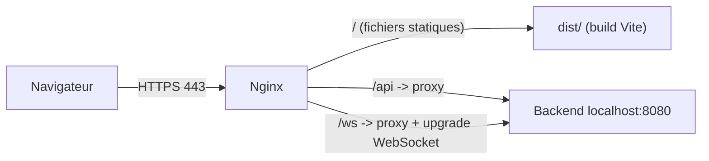

## Architecture cible



Front et back partagent la même origine -> le front utilisera des chemins relatifs (`/api`, `/ws`), donc pas de CORS et rien de codé en dur.

## 1. Configurer les variables d'environnement de prod

Mettre a jour [.env.production](.env.production) pour utiliser les variables réellement lues par le code (`VITE_API_BASE_URL` dans [src/shared/api/http.ts](src/shared/api/http.ts) et `VITE_WS_URL` dans [src/shared/api/presence/hooks.ts](src/shared/api/presence/hooks.ts)) :

```env
VITE_API_BASE_URL=/api
VITE_WS_URL=/ws
```

Remarque : l'actuel `.env.production` contient `VITE_API_URL=https://api.example.com` qui n'est qu'un fallback secondaire ; on le remplace par les bonnes clés. Les chemins relatifs marchent car Nginx proxifie `/api` et `/ws`.

## 2. Ajouter la config Nginx au dépôt

Créer `deploy/nginx/acredispace.conf` (server block) :
- `root /var/www/acredispace/dist;` + `try_files $uri $uri/ /index.html;` (routing SPA React Router).
- `location /api/ { proxy_pass http://127.0.0.1:8080; }` avec en-têtes `Host`, `X-Real-IP`, `X-Forwarded-For`, `X-Forwarded-Proto`.
- `location /ws { proxy_pass http://127.0.0.1:8080; }` avec `proxy_http_version 1.1`, `Upgrade`/`Connection "upgrade"`, et timeouts longs pour STOMP/SockJS.
- Cache long sur les assets hashés (`/assets/`), pas de cache sur `index.html`.
- gzip activé, taille upload (`client_max_body_size`) augmentée pour l'upload de fichiers.
- Bloc port 80 -> redirection 443 (rempli/géré par Certbot).

## 3. Ajouter un guide de déploiement

Créer `DEPLOYMENT.md` (FR) avec les étapes VPS (Ubuntu/Debian) :
- Prérequis : Node 20+, Nginx, Certbot.
- Build : `npm ci && npm run build` (sortie `dist/`), copie vers `/var/www/acredispace/dist`.
- Installation du fichier conf dans `/etc/nginx/sites-available/` + symlink `sites-enabled`, `nginx -t`, `systemctl reload nginx`.
- SSL : `certbot --nginx -d mondomaine.com -d www.mondomaine.com`.
- Commande de mise a jour (re-build + recopie).

## 4. (Optionnel) Script de déploiement

Ajouter `deploy/deploy.sh` qui automatise build + sync vers `/var/www/acredispace/dist` + `nginx -s reload`, pour simplifier les futures mises a jour (déploiement sans Docker).

## 5. Dockerfile (multi-stage front + Nginx)

Créer `Dockerfile` à la racine :
- Stage 1 `node:20-alpine` : `npm ci`, `npm run build` (avec `.env.production` -> `VITE_API_BASE_URL=/api`, `VITE_WS_URL=/ws` embarqués au build).
- Stage 2 `nginx:alpine` : copie de `dist/` dans `/usr/share/nginx/html`, et d'une conf `deploy/nginx/default.conf` adaptée au conteneur, expose le port 80.

Ajouter aussi :
- `.dockerignore` (node_modules, dist, .git, .env local, etc.).
- `deploy/nginx/default.conf` : variante "conteneur" de la conf (SPA fallback + proxy `/api` et `/ws`). Comme le backend tourne sur l'hôte VPS, le `proxy_pass` pointera vers `host.docker.internal:8080` (ou l'IP de la gateway Docker / un réseau dédié). Le TLS reste géré par le Nginx système (ou un reverse-proxy) en frontal -> le conteneur écoute en HTTP sur 80, mappé sur un port local (ex: `127.0.0.1:8081`).

Build/run local :

```bash
docker build -t acredispace-front .
docker run -d -p 127.0.0.1:8081:80 --add-host=host.docker.internal:host-gateway acredispace-front
```

## 6. GitHub Actions (build image -> Docker Hub -> deploy VPS)

Créer `.github/workflows/deploy.yml` déclenché sur push `main` :
- Job `build-and-push` : `docker/login-action` vers Docker Hub, `docker/build-push-action` qui build et pousse l'image taguée (`<dockerhub-user>/acredispace-front:latest` + SHA).
- Job `deploy` (après build) : connexion SSH au VPS via `appleboy/ssh-action`, `docker login`, `docker pull`, `docker stop/rm`, `docker run` du nouveau conteneur (mappé sur `127.0.0.1:8081:80`).
- Secrets requis (à créer dans le repo GitHub) : `DOCKERHUB_USERNAME`, `DOCKERHUB_TOKEN` (access token Docker Hub), `VPS_HOST`, `VPS_USER`, `VPS_SSH_KEY`.

Documenter ces secrets dans `DEPLOYMENT.md`.

## Note : Nginx déjà présent sur le VPS

Nginx est déjà installé -> pas d'installation à prévoir. Le Nginx système agit comme reverse-proxy frontal :
- HTTPS 443 (certif Let's Encrypt) -> reverse-proxy vers le conteneur front `http://127.0.0.1:8081`.
- Il continue aussi de proxifier `/api` et `/ws` vers le backend `127.0.0.1:8080`.
- Les sections 2 (conf Nginx) et 3 (Certbot) restent valables ; on ajoute juste le `proxy_pass` vers le conteneur front au lieu de servir `dist/` en direct.
- La conf interne du conteneur (`deploy/nginx/default.conf`) peut donc se limiter au SPA fallback (le proxy `/api` `/ws` étant assuré par le Nginx système). À décider à l'implémentation : tout centraliser sur le Nginx système (conteneur = simple serveur statique).

## Points a confirmer pendant l'implémentation
- Le nom de domaine exact et le port réel du backend (supposé `8080`) seront à remplacer dans la conf.
- `dist` est dans `.gitignore` : le build se fait dans l'image Docker / sur le VPS, pas committé.
- Le nom d'utilisateur Docker Hub pour le tag de l'image (`<dockerhub-user>/acredispace-front`).
- Répartition du reverse-proxy `/api` `/ws` : sur le Nginx système (recommandé) plutôt que dans le conteneur.