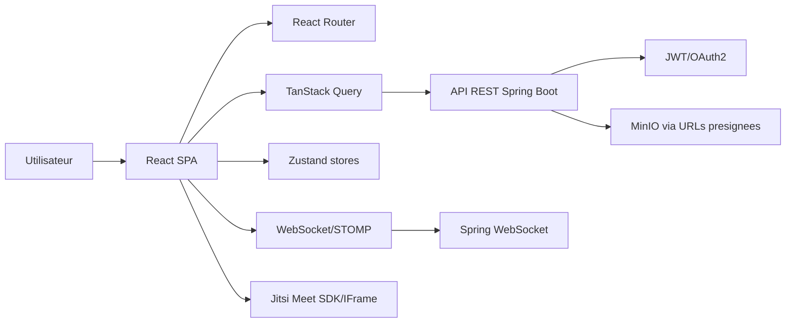
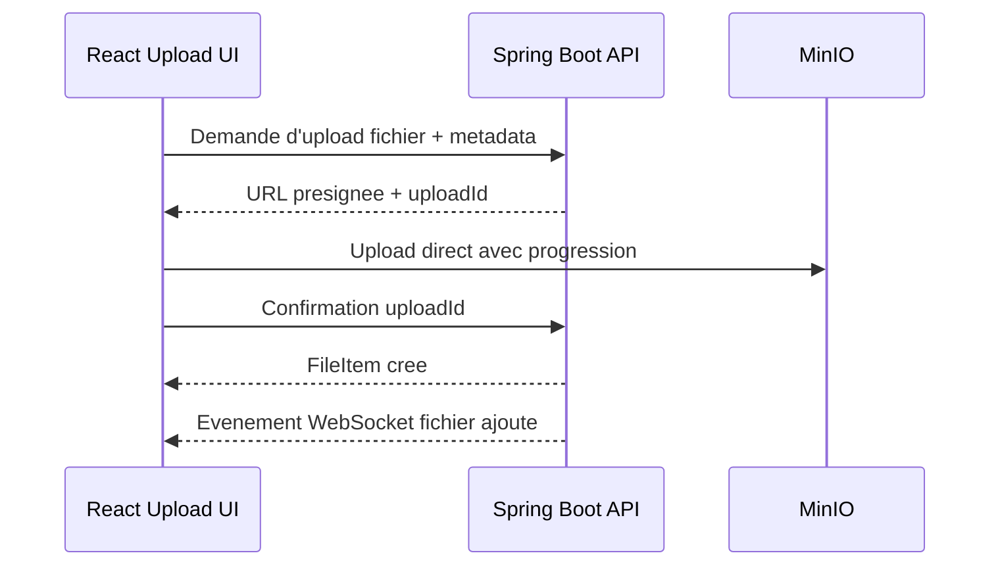

# Analyse du cahier des charges et architecture frontend React

## 1. Lecture globale du besoin

Le cahier des charges demande une plateforme web interne pour Acredi Group. Le problème central est la dispersion des fichiers de travail entre collaborateurs, ce qui oblige les employés à se contacter hors horaires de bureau pour obtenir des documents. La solution attendue doit centraliser les fichiers, sécuriser les accès, tracer les actions et intégrer une communication temps réel proche de Microsoft Teams.

Le projet n'est pas une simple application de stockage. C'est une plateforme collaborative complète, composée de quatre grands blocs :

- un espace documentaire sécurisé ;
- une gestion fine des utilisateurs, rôles, équipes et permissions ;
- une couche de communication en temps réel : chat, canaux, présence, notifications ;
- une couche réunion : calendrier, visioconférence Jitsi, partage d'écran, enregistrements et salles de sous-groupes.

Le document initial mentionne Angular comme technologie frontend. Comme la demande actuelle impose React, cette architecture remplace Angular par React tout en conservant les autres choix techniques cohérents avec le cahier des charges : Spring Boot, PostgreSQL, WebSocket, Jitsi Meet, MinIO, JWT/OAuth2, Docker et Nginx.

## 2. Acteurs et permissions

La plateforme distingue trois profils.

| Role | Responsabilite | Capacites frontend principales |
| --- | --- | --- |
| Administrateur | Responsable IT ou direction | Acces global, utilisateurs, equipes, fichiers, audit, configuration |
| Manager | Chef d'equipe | Gestion de son equipe, dossiers partages, canaux, reunions, membres |
| Collaborateur | Employe standard | Depot, consultation, partage limite, chat, reunions |

La logique frontend doit afficher ou masquer les actions selon le role, mais le backend reste toujours l'autorite finale. Aucun bouton cache cote frontend ne doit etre considere comme une vraie securite.

Regles essentielles :

- un collaborateur voit ses fichiers, les fichiers de son equipe et les fichiers partages specifiquement avec lui ;
- un manager gere les espaces, membres, dossiers, canaux et reunions de son equipe ;
- un administrateur voit toute l'organisation et peut supprimer ou administrer les fichiers des autres ;
- les permissions fichier sont : lecture, edition, administration ;
- un fichier peut etre prive, accessible a l'equipe ou partage avec des personnes precises.

## 3. Domaines fonctionnels frontend

L'application React doit etre organisee autour de domaines metier, pas autour de simples types techniques. Les domaines principaux sont :

1. Authentification et session
2. Tableau de bord
3. Fichiers et dossiers
4. Permissions et partages
5. Equipes
6. Chat et canaux
7. Reunions et calendrier
8. Presence et statuts
9. Notifications
10. Administration
11. Profil utilisateur
12. Audit et journalisation visible admin

Cette separation permet de developper progressivement le projet sur les 8 semaines prevues sans creer un frontend monolithique difficile a maintenir.

## 4. Stack frontend recommandee

| Besoin | Choix recommande | Raison |
| --- | --- | --- |
| Framework | React + TypeScript | Typage fort, composants reutilisables, ecosysteme riche |
| Build | Vite | Demarrage rapide, configuration simple, bon DX |
| Routing | React Router | Routes privees, layouts imbriques, lazy loading |
| Data fetching | TanStack Query | Cache API, invalidation, mutations, synchronisation serveur |
| Etat local global | Zustand | Session UI, preferences, panneaux, etats temporaires |
| Formulaires | React Hook Form + Zod | Validation robuste et lisible |
| UI | Tailwind CSS + Radix UI/shadcn/ui + lucide-react | Interface moderne, accessible, rapide a construire |
| Tables | TanStack Table | Utilisateurs, audit, fichiers, permissions |
| Upload | react-dropzone + client upload dedie | Drag/drop, progression, validation |
| Calendrier | FullCalendar ou React Big Calendar | Reunions planifiees et recurrence |
| Temps reel | WebSocket/STOMP client | Chat, notifications, presence |
| Visioconference | Jitsi Meet External API ou @jitsi/react-sdk | Integration directe des salles |
| Offline | Service Worker + IndexedDB | Cache minimal et synchronisation differee |
| Tests | Vitest + Testing Library + Playwright | Tests unitaires, composants et parcours critiques |

## 5. Architecture logique



Le frontend React consomme l'API REST pour les donnees persistantes, utilise WebSocket pour les evenements temps reel et integre Jitsi dans les pages de reunion. Les fichiers ne doivent pas etre manipules directement avec des secrets MinIO : le frontend demande au backend une autorisation ou une URL presignee.

## 6. Structure de projet recommandee

```text
src/
  app/
    App.tsx
    router/
      routes.tsx
      routeGuards.tsx
    providers/
      AppProviders.tsx
      QueryProvider.tsx
      AuthProvider.tsx
      RealtimeProvider.tsx
    layouts/
      AuthLayout.tsx
      WorkspaceLayout.tsx
      AdminLayout.tsx
    config/
      env.ts
      permissions.ts
      navigation.ts

  shared/
    components/
      Button/
      Dialog/
      EmptyState/
      FileIcon/
      Loader/
      PageHeader/
      PermissionBadge/
      SearchInput/
      Sidebar/
      Toast/
    hooks/
      useDebounce.ts
      useMediaQuery.ts
      usePermissions.ts
    lib/
      date.ts
      fileSize.ts
      mime.ts
      validators.ts
    types/
      api.ts
      pagination.ts

  services/
    api/
      httpClient.ts
      authApi.ts
      filesApi.ts
      teamsApi.ts
      chatApi.ts
      meetingsApi.ts
      notificationsApi.ts
      adminApi.ts
    realtime/
      socketClient.ts
      subscriptions.ts
      realtimeEvents.ts
    storage/
      uploadClient.ts
      downloadClient.ts
    jitsi/
      jitsiClient.ts

  entities/
    user/
      user.types.ts
      user.utils.ts
    team/
      team.types.ts
    file/
      file.types.ts
      file.permissions.ts
    chat/
      chat.types.ts
    meeting/
      meeting.types.ts
    notification/
      notification.types.ts
    audit/
      audit.types.ts

  features/
    auth/
      pages/
      components/
      hooks/
      auth.store.ts
    dashboard/
      pages/
      components/
    files/
      pages/
      components/
      hooks/
      fileExplorer.store.ts
    sharing/
      components/
      hooks/
    teams/
      pages/
      components/
    chat/
      pages/
      components/
      hooks/
      chat.store.ts
    meetings/
      pages/
      components/
      hooks/
    notifications/
      components/
      hooks/
    admin/
      pages/
      components/
    profile/
      pages/
      components/

  assets/
  styles/
    globals.css
```

Principe important : chaque feature contient ses pages, composants et hooks specifiques. Les composants vraiment reutilisables vont dans `shared`. Les appels backend sont centralises dans `services/api`. Les types metier transverses vont dans `entities`.

## 7. Routing complet

```text
/login
/forgot-password
/reset-password/:token

/app
/app/dashboard
/app/files
/app/files/personal
/app/files/team/:teamId
/app/files/shared-with-me
/app/files/recent
/app/files/trash
/app/files/:fileId
/app/files/:fileId/versions

/app/chat
/app/chat/channels/:channelId
/app/chat/direct/:userId

/app/meetings
/app/meetings/calendar
/app/meetings/new
/app/meetings/:meetingId
/app/meetings/:meetingId/room
/app/meetings/:meetingId/recordings

/app/teams
/app/teams/:teamId
/app/teams/:teamId/members
/app/teams/:teamId/channels

/app/notifications
/app/profile
/app/settings

/admin
/admin/dashboard
/admin/users
/admin/users/:userId
/admin/teams
/admin/files
/admin/audit-logs
/admin/platform-settings
```

Les routes publiques utilisent `AuthLayout`. Les routes internes utilisent `WorkspaceLayout`. Les routes admin utilisent `AdminLayout` et un guard `requireRole("ADMIN")`.

## 8. Layout applicatif

Le layout principal doit etre pense pour une application de travail quotidienne.

Elements fixes :

- sidebar gauche : Dashboard, Fichiers, Chat, Reunions, Equipes, Notifications, Admin si autorise ;
- topbar : recherche globale, statut de presence, bouton notification, menu profil ;
- zone centrale : contenu de la route ;
- panneau lateral contextuel optionnel : details fichier, fil de discussion, participants, permissions.

Sur mobile :

- sidebar transformee en navigation basse ou drawer ;
- listes et panneaux details affiches en navigation progressive ;
- actions principales accessibles par bouton flottant ou barre d'actions compacte.

## 9. Module authentification

Fonctionnalites :

- connexion email/mot de passe ;
- mot de passe oublie ;
- reset par token email ;
- deconnexion securisee ;
- recuperation de session au refresh ;
- redirection selon role ;
- expiration de session avec renouvellement si refresh token disponible.

Composants :

- `LoginPage`
- `ForgotPasswordPage`
- `ResetPasswordPage`
- `AuthGuard`
- `RoleGuard`
- `SessionExpiredDialog`

Gestion recommandee :

- access token court ;
- refresh token en cookie HTTP-only si le backend le permet ;
- intercepteur HTTP pour ajouter l'authentification et traiter les erreurs 401 ;
- nettoyage du cache TanStack Query a la deconnexion.

## 10. Module fichiers

Ce module est le coeur du produit.

Pages :

- explorateur de fichiers ;
- fichiers personnels ;
- fichiers d'equipe ;
- fichiers partages avec moi ;
- fichiers recents ;
- corbeille ;
- detail fichier ;
- historique de versions.

Composants :

- `FileExplorerPage`
- `FolderTree`
- `FileToolbar`
- `FileGrid`
- `FileTable`
- `FilePreviewPanel`
- `UploadDropzone`
- `UploadProgressList`
- `MoveFileDialog`
- `RenameFileDialog`
- `ShareFileDialog`
- `FileVersionDrawer`
- `FileAccessPanel`
- `BatchDownloadButton`

Actions a supporter :

- depot multi-fichiers ;
- creation dossier/sous-dossier ;
- telechargement individuel ;
- telechargement en lot ZIP ;
- deplacement ;
- suppression ;
- restauration depuis corbeille ;
- remplacement de fichier pour creer une nouvelle version ;
- apercu PDF et image ;
- attribution des droits lecture, edition, administration.

Flux upload recommande :



Le frontend ne doit pas decider seul si un fichier est autorise. Il valide pour l'experience utilisateur, mais le backend valide aussi taille, type, dossier cible et permissions.

## 11. Module permissions et partage

La permission doit etre modelisee explicitement.

Types principaux :

```ts
type Role = "ADMIN" | "MANAGER" | "COLLABORATOR";
type FileVisibility = "PRIVATE" | "TEAM" | "SPECIFIC";
type FilePermission = "READ" | "EDIT" | "ADMIN";
```

Composants :

- `PermissionGate`
- `RoleBadge`
- `ShareFileDialog`
- `UserPermissionPicker`
- `TeamPermissionPicker`
- `AccessRevocationDialog`
- `PermissionMatrix`

Regle d'architecture : les guards frontend servent a ameliorer l'UX, pas a securiser les donnees. Toute action critique doit passer par une revalidation backend.

## 12. Module chat et canaux

Fonctionnalites :

- canaux par equipe/projet ;
- messages directs ;
- chat de reunion ;
- reactions emoji ;
- threads/reponses ;
- mentions `@utilisateur` ;
- partage de fichiers dans le chat ;
- historique pagine ;
- statut en ligne des participants.

Pages et composants :

- `ChatPage`
- `ChannelList`
- `DirectMessageList`
- `MessageList`
- `MessageItem`
- `MessageComposer`
- `ThreadPanel`
- `MentionAutocomplete`
- `ReactionPicker`
- `AttachmentPicker`

Flux temps reel :

- recuperer l'historique via REST ;
- s'abonner au canal WebSocket ;
- ajouter les nouveaux messages au cache ;
- marquer les messages lus ;
- afficher les indicateurs de typing ;
- gerer reconnexion et resynchronisation.

Topics possibles :

```text
/topic/channels/{channelId}/messages
/topic/channels/{channelId}/typing
/user/queue/direct-messages
/topic/meetings/{meetingId}/chat
```

## 13. Module reunions et calendrier

Fonctionnalites :

- calendrier des reunions ;
- creation de reunion immediate ou planifiee ;
- invitations par email/lien ;
- recurrence quotidienne, hebdomadaire, mensuelle ;
- rappels ;
- salle Jitsi integree ;
- chat de reunion ;
- participants ;
- levee de main ;
- reactions ;
- partage d'ecran ;
- breakout rooms via Jitsi si disponible dans la configuration ;
- acces aux enregistrements sauvegardes.

Pages et composants :

- `MeetingsPage`
- `CalendarPage`
- `CreateMeetingDialog`
- `MeetingDetailsPage`
- `MeetingRoomPage`
- `MeetingParticipantsPanel`
- `MeetingChatPanel`
- `RecordingList`

Integration Jitsi :

- le backend cree l'identifiant de salle et les droits ;
- le frontend affiche la salle via Jitsi SDK/IFrame ;
- l'utilisateur ne rejoint une salle que si l'API confirme son droit d'acces ;
- les evenements Jitsi utiles peuvent mettre a jour le statut de presence.

## 14. Presence et notifications

Statuts :

- disponible ;
- occupe ;
- absent ;
- hors ligne ;
- en reunion ;
- statut personnalise.

Notifications :

- nouveau fichier dans une equipe ;
- fichier partage avec moi ;
- invitation reunion ;
- rappel reunion ;
- mention dans un message ;
- nouveau message direct ;
- changement de permission ;
- echec/succes upload.

Composants :

- `PresenceIndicator`
- `StatusMenu`
- `NotificationBell`
- `NotificationCenter`
- `ToastStack`

La presence doit etre envoyee par WebSocket, avec heartbeat, detection d'inactivite et bascule automatique vers hors ligne a la deconnexion.

## 15. Module administration

Accessible uniquement aux administrateurs.

Pages :

- tableau de bord admin ;
- gestion utilisateurs ;
- creation/modification/desactivation compte ;
- gestion roles ;
- gestion equipes ;
- supervision fichiers ;
- journaux d'audit ;
- configuration plateforme.

Composants :

- `UserTable`
- `UserFormDialog`
- `TeamTable`
- `TeamMembersManager`
- `AuditLogTable`
- `PlatformSettingsForm`
- `StorageUsageWidget`

Le dashboard admin doit afficher :

- nombre d'utilisateurs actifs ;
- stockage utilise ;
- derniers fichiers ajoutes ;
- reunions recentes ;
- actions sensibles recentes ;
- erreurs systeme exposees par l'API si disponible.

## 16. Tableau de bord utilisateur

Le dashboard doit donner une vision immediate du travail.

Contenu recommande :

- fichiers recents ;
- fichiers partages recemment avec moi ;
- prochaines reunions ;
- derniers messages ou mentions ;
- notifications non lues ;
- membres de mon equipe en ligne ;
- raccourcis : uploader, creer reunion, ouvrir chat.

L'objectif est de reduire le nombre de clics pour les actions frequentes.

## 17. Recherche avancee

Recherche globale depuis la topbar :

- fichiers par nom, type, proprietaire, equipe ;
- messages ;
- canaux ;
- utilisateurs ;
- reunions.

Architecture :

- champ global avec debounce ;
- page de resultats dediee ;
- filtres par type de contenu ;
- pagination/infinite scroll ;
- recherche backend obligatoire pour respecter les droits d'acces.

## 18. Mode hors ligne

Le cahier des charges mentionne un mode hors-ligne avec synchronisation. Il faut le limiter proprement pour rester realiste.

Mode hors ligne recommande pour V1 :

- afficher les fichiers/metadonnees deja consultes ;
- afficher les conversations recemment chargees ;
- permettre la redaction de messages en brouillon ;
- mettre en file d'attente certains envois simples ;
- reprendre les uploads interrompus si l'implementation backend le permet.

Ne pas promettre en V1 :

- edition collaborative offline de fichiers ;
- synchronisation complete type Google Drive ;
- resolution avancee de conflits.

## 19. Modeles TypeScript principaux

```ts
export interface User {
  id: string;
  email: string;
  firstName: string;
  lastName: string;
  avatarUrl?: string;
  role: Role;
  teamIds: string[];
  presence: PresenceStatus;
}

export interface Team {
  id: string;
  name: string;
  managerId: string;
  memberIds: string[];
}

export interface FileItem {
  id: string;
  name: string;
  mimeType: string;
  size: number;
  ownerId: string;
  teamId?: string;
  folderId?: string;
  visibility: FileVisibility;
  permission: FilePermission;
  version: number;
  createdAt: string;
  updatedAt: string;
}

export interface Meeting {
  id: string;
  title: string;
  startsAt: string;
  endsAt: string;
  organizerId: string;
  participantIds: string[];
  recurrence?: MeetingRecurrence;
  jitsiRoomName: string;
}

export interface Message {
  id: string;
  channelId?: string;
  directConversationId?: string;
  meetingId?: string;
  authorId: string;
  body: string;
  attachments: MessageAttachment[];
  threadRootId?: string;
  createdAt: string;
  editedAt?: string;
}
```

## 20. Appels API frontend attendus

Auth :

```text
POST /api/auth/login
POST /api/auth/logout
POST /api/auth/refresh
POST /api/auth/forgot-password
POST /api/auth/reset-password
GET  /api/auth/me
```

Fichiers :

```text
GET    /api/files
GET    /api/files/{id}
POST   /api/files/upload-intent
POST   /api/files/{id}/complete-upload
GET    /api/files/{id}/download
POST   /api/files/batch-download
PATCH  /api/files/{id}
DELETE /api/files/{id}
GET    /api/files/{id}/versions
POST   /api/files/{id}/versions
```

Permissions :

```text
GET    /api/files/{id}/permissions
POST   /api/files/{id}/share
PATCH  /api/files/{id}/permissions/{permissionId}
DELETE /api/files/{id}/permissions/{permissionId}
```

Chat :

```text
GET  /api/channels
GET  /api/channels/{id}/messages
POST /api/channels/{id}/messages
GET  /api/direct-conversations
POST /api/direct-conversations/{id}/messages
```

Reunions :

```text
GET  /api/meetings
POST /api/meetings
GET  /api/meetings/{id}
PATCH /api/meetings/{id}
POST /api/meetings/{id}/join
GET  /api/meetings/{id}/recordings
```

Admin :

```text
GET    /api/admin/users
POST   /api/admin/users
PATCH  /api/admin/users/{id}
GET    /api/admin/teams
POST   /api/admin/teams
PATCH  /api/admin/teams/{id}
GET    /api/admin/audit-logs
```

## 21. Strategie de donnees et cache

TanStack Query doit etre la source principale des donnees serveur.

Regles :

- `useQuery` pour listes et details ;
- `useMutation` pour creation, modification, suppression ;
- invalidation ciblee apres mutation ;
- optimistic update uniquement pour chat/reactions si rollback simple ;
- pagination pour fichiers, messages et audit ;
- cache separe par utilisateur connecte ;
- nettoyage complet du cache a la deconnexion.

Exemples de query keys :

```ts
["me"]
["files", { folderId, teamId, search, page }]
["file", fileId]
["file-permissions", fileId]
["channels"]
["channel-messages", channelId]
["meetings", { from, to }]
["notifications"]
["admin-users", filters]
```

## 22. Strategie securite frontend

Mesures indispensables :

- forcer HTTPS en production ;
- ne pas stocker de token long terme dans `localStorage` ;
- utiliser cookies HTTP-only pour refresh token si possible ;
- proteger les routes par session et role ;
- sanitiser le rendu des messages si format riche ;
- refuser l'affichage inline des types fichiers dangereux ;
- verifier les tailles et extensions avant upload ;
- gerer proprement les erreurs 401/403 ;
- appliquer une Content Security Policy via Nginx ;
- masquer les informations sensibles dans les logs navigateur ;
- ne jamais exposer de secrets MinIO/Jitsi dans le bundle.

## 23. Performance

Objectif du cahier des charges : chargement du dashboard sous 2 secondes.

Actions frontend :

- code splitting par route avec `React.lazy` ;
- prefetch des donnees apres login ;
- lazy loading des modules lourds : Jitsi, calendrier, preview PDF ;
- virtualisation des grandes listes de fichiers/messages ;
- pagination backend ;
- images/avatar optimises ;
- cache HTTP pour assets statiques ;
- compression gzip/brotli via Nginx ;
- skeleton loaders au lieu de pages blanches.

## 24. Accessibilite et ergonomie

Exigences :

- responsive desktop/mobile ;
- contrastes suffisants ;
- navigation clavier pour dialogs, menus, listes ;
- labels explicites sur champs de formulaire ;
- focus visible ;
- messages d'erreur comprehensibles ;
- tables filtrables et lisibles ;
- confirmations pour suppressions et revocations d'acces.

Pour ce type d'application interne, l'interface doit etre dense, claire et orientee productivite : pas de landing page marketing, pas d'effets visuels inutiles, priorité a la recherche, aux listes, aux actions rapides et aux statuts visibles.

## 25. Tests frontend

Tests unitaires :

- helpers de permission ;
- validation formulaires ;
- formatage fichiers/dates ;
- reducers/stores locaux.

Tests composants :

- login ;
- explorateur fichier ;
- dialogue de partage ;
- create meeting ;
- message composer ;
- user table admin.

Tests end-to-end Playwright :

- connexion et redirection selon role ;
- upload fichier ;
- partage avec utilisateur ;
- refus acces sans permission ;
- creation reunion ;
- envoi message canal ;
- admin cree un utilisateur.

## 26. Decoupage MVP recommande

Le cahier des charges est ambitieux pour 8 semaines. Pour livrer proprement, il faut decouper.

MVP 1 - Base securisee :

- auth ;
- layouts ;
- roles ;
- dashboard simple ;
- profil ;
- gestion utilisateurs admin.

MVP 2 - Fichiers :

- explorer fichiers ;
- upload/download ;
- dossiers ;
- partage simple ;
- permissions ;
- versions de base.

MVP 3 - Collaboration :

- chat canaux ;
- messages directs ;
- notifications ;
- presence.

MVP 4 - Reunions :

- calendrier ;
- creation reunion ;
- integration Jitsi ;
- chat reunion ;
- enregistrements si backend/Jitsi configure.

MVP 5 - Durcissement :

- audit admin ;
- recherche avancee ;
- offline limite ;
- tests E2E ;
- optimisation performance.

## 27. Points de vigilance

Les parties les plus sensibles du frontend sont :

- la coherence des permissions affichees ;
- la synchronisation temps reel entre REST cache et WebSocket ;
- la gestion d'upload avec progression, echec et reprise ;
- l'integration Jitsi et les droits d'acces aux salles ;
- la recherche globale avec respect strict des permissions ;
- le mode hors ligne, qui peut vite depasser le perimetre du stage ;
- l'audit, qui doit etre complet cote backend meme si le frontend n'affiche qu'une partie.

## 28. Architecture cible resumee

L'architecture React cible est une SPA TypeScript structuree par features, connectee a Spring Boot par REST et WebSocket. TanStack Query gere les donnees serveur, Zustand gere l'etat UI local, React Router separe les espaces public, utilisateur et admin, et Jitsi est integre comme module charge a la demande. Les fichiers passent par une couche upload dediee, idealement via URLs presignees MinIO, tandis que les permissions sont gerees avec une combinaison de guards frontend et de validations backend.

Cette architecture permet de couvrir tout le cahier des charges tout en restant evolutive : on peut commencer par auth + fichiers, puis ajouter chat, presence, calendrier, Jitsi, administration et offline sans casser la base.
